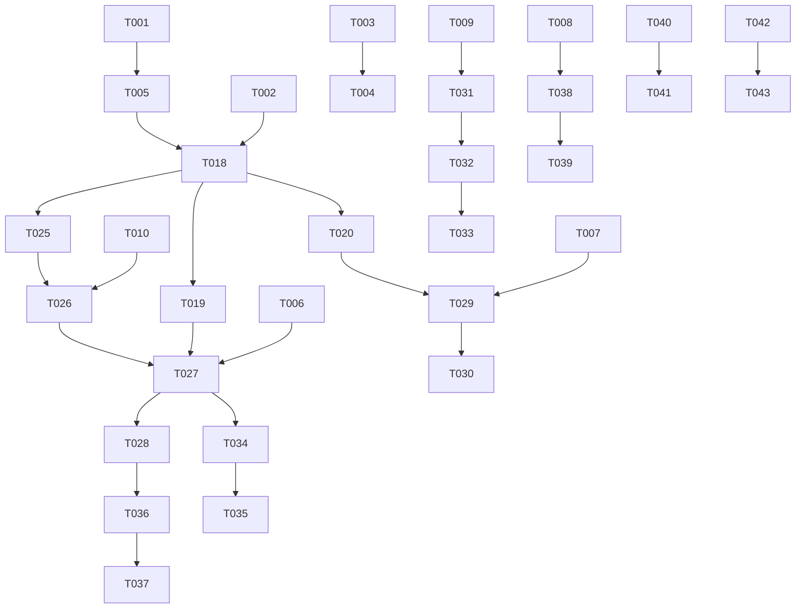

# Tasks: Rust Library for Taskwarrior Integration

**Input**: Design documents from `/specs/001-a-rust-library/`
**Prerequisites**: plan.md (required), research.md, data-model.md, contracts/

## Execution Flow (main)

```
1. Load plan.md from feature directory
   → If not found: ERROR "No implementation plan found"
   → Extract: tech stack, libraries, structure
2. Load optional design documents:
   → data-model.md: Extract entities → model tasks
   → contracts/: Each file → contract test task
   → research.md: Extract decisions → setup tasks
3. Generate tasks by category:
   → Setup: project init, dependencies, linting
   → Tests: contract tests, integration tests
   → Core: models, services, CLI commands
   → Integration: DB, middleware, logging
   → Polish: unit tests, performance, docs
4. Apply task rules:
   → Different files = mark [P] for parallel
   → Same file = sequential (no [P])
   → Tests before implementation (TDD)
5. Number tasks sequentially (T001, T002...)
6. Generate dependency graph
7. Create parallel execution examples
8. Validate task completeness:
   → All contracts have tests?
   → All entities have models?
   → All endpoints implemented?
9. Return: SUCCESS (tasks ready for execution)
```

## Format: `[ID] [P?] Description`

- **[P]**: Can run in parallel (different files, no dependencies)
- Include exact file paths in descriptions

## Path Conventions

- **Single project**: `src/`, `tests/` at repository root
- Paths shown below assume single project structure from implementation plan

## Phase 3.1: Setup

- [ ] T001 Create Rust library project structure with Cargo.toml in `/Users/jmartin/Development/rust/taskwarriorlib-rs/Cargo.toml`
- [ ] T002 [P] Add dependencies: serde, serde_json, chrono, chrono-tz, uuid, thiserror, dirs, tokio (optional)
- [ ] T003 [P] Configure development dependencies: tempfile, criterion for benchmarks
- [ ] T004 [P] Set up CI/CD with rustfmt, clippy, and cargo audit in `.github/workflows/`
- [ ] T005 [P] Create lib.rs with module declarations in `/Users/jmartin/Development/rust/taskwarriorlib-rs/src/lib.rs`

## Phase 3.2: Tests First (TDD) ⚠️ MUST COMPLETE BEFORE 3.3

### Contract Tests

- [ ] T006 [P] Create TaskManager trait test suite in `/Users/jmartin/Development/rust/taskwarriorlib-rs/tests/integration/task_manager_tests.rs`
- [ ] T007 [P] Create TaskQueryBuilder trait test suite in `/Users/jmartin/Development/rust/taskwarriorlib-rs/tests/integration/query_builder_tests.rs`
- [ ] T008 [P] Create TaskHook trait test suite in `/Users/jmartin/Development/rust/taskwarriorlib-rs/tests/integration/hook_tests.rs`
- [ ] T009 [P] Create DateParser trait test suite in `/Users/jmartin/Development/rust/taskwarriorlib-rs/tests/integration/date_parser_tests.rs`
- [ ] T010 [P] Create Configuration trait test suite in `/Users/jmartin/Development/rust/taskwarriorlib-rs/tests/integration/config_tests.rs`

### Integration Tests (from quickstart scenarios)

- [ ] T011 [P] Create basic task CRUD operations test in `/Users/jmartin/Development/rust/taskwarriorlib-rs/tests/integration/basic_operations.rs`
- [ ] T012 [P] Create XDG directory configuration discovery test in `/Users/jmartin/Development/rust/taskwarriorlib-rs/tests/integration/config_discovery.rs`
- [ ] T013 [P] Create task querying and filtering test in `/Users/jmartin/Development/rust/taskwarriorlib-rs/tests/integration/query_filtering.rs`
- [ ] T014 [P] Create date parsing and validation test in `/Users/jmartin/Development/rust/taskwarriorlib-rs/tests/integration/date_handling.rs`
- [ ] T015 [P] Create task annotations and time tracking test in `/Users/jmartin/Development/rust/taskwarriorlib-rs/tests/integration/task_operations.rs`
- [ ] T016 [P] Create JSON import/export test in `/Users/jmartin/Development/rust/taskwarriorlib-rs/tests/integration/json_io.rs`
- [ ] T017 [P] Create context and report management test in `/Users/jmartin/Development/rust/taskwarriorlib-rs/tests/integration/context_reports.rs`

## Phase 3.3: Core Implementation

### Error Types

- [ ] T018 Implement error types with thiserror in `/Users/jmartin/Development/rust/taskwarriorlib-rs/src/error.rs`

### Data Models (can run in parallel - different files)

- [ ] T019 [P] Implement Task struct and TaskStatus enum in `/Users/jmartin/Development/rust/taskwarriorlib-rs/src/task/model.rs`
- [ ] T020 [P] Implement TaskQuery and filtering types in `/Users/jmartin/Development/rust/taskwarriorlib-rs/src/query/mod.rs`
- [ ] T021 [P] Implement Context and Report models in `/Users/jmartin/Development/rust/taskwarriorlib-rs/src/context.rs`
- [ ] T022 [P] Implement RecurrencePattern and UdaValue types in `/Users/jmartin/Development/rust/taskwarriorlib-rs/src/task/recurrence.rs`
- [ ] T023 [P] Implement Annotation and Priority types in `/Users/jmartin/Development/rust/taskwarriorlib-rs/src/task/annotation.rs`
- [ ] T024 [P] Implement DateParser and DateSynonym types in `/Users/jmartin/Development/rust/taskwarriorlib-rs/src/date/mod.rs`

### Configuration System

- [ ] T025 Implement XDG directory discovery in `/Users/jmartin/Development/rust/taskwarriorlib-rs/src/config/discovery.rs`
- [ ] T026 Implement Configuration struct and parsing in `/Users/jmartin/Development/rust/taskwarriorlib-rs/src/config/mod.rs`

### Core Services (sequential - shared files)

- [ ] T027 Implement TaskManager trait and builder in `/Users/jmartin/Development/rust/taskwarriorlib-rs/src/task/manager.rs`
- [ ] T028 Implement task CRUD operations in `/Users/jmartin/Development/rust/taskwarriorlib-rs/src/task/operations.rs`
- [ ] T029 Implement TaskQueryBuilder trait in `/Users/jmartin/Development/rust/taskwarriorlib-rs/src/query/builder.rs`
- [ ] T030 Implement query filter parsing in `/Users/jmartin/Development/rust/taskwarriorlib-rs/src/query/filter.rs`

### Date System

- [ ] T031 [P] Implement date parsing with ISO-8601 support in `/Users/jmartin/Development/rust/taskwarriorlib-rs/src/date/parser.rs`
- [ ] T032 [P] Implement date synonym expansion in `/Users/jmartin/Development/rust/taskwarriorlib-rs/src/date/synonyms.rs`
- [ ] T033 [P] Implement relative date calculations in `/Users/jmartin/Development/rust/taskwarriorlib-rs/src/date/relative.rs`

### Report System

- [ ] T034 [P] Implement built-in reports in `/Users/jmartin/Development/rust/taskwarriorlib-rs/src/reports/builtin.rs`
- [ ] T035 [P] Implement custom report execution in `/Users/jmartin/Development/rust/taskwarriorlib-rs/src/reports/mod.rs`

## Phase 3.4: Integration Features

### File System Integration

- [ ] T036 Implement Taskwarrior database file access with locking in `/Users/jmartin/Development/rust/taskwarriorlib-rs/src/storage/mod.rs`
- [ ] T037 Implement task data serialization/deserialization in `/Users/jmartin/Development/rust/taskwarriorlib-rs/src/storage/serialization.rs`

### Hook System

- [ ] T038 [P] Implement TaskHook trait and registry in `/Users/jmartin/Development/rust/taskwarriorlib-rs/src/hooks/mod.rs`
- [ ] T039 [P] Implement hook lifecycle events in `/Users/jmartin/Development/rust/taskwarriorlib-rs/src/hooks/events.rs`

### Sync System

- [ ] T040 [P] Implement SyncReplica management in `/Users/jmartin/Development/rust/taskwarriorlib-rs/src/sync/replica.rs`
- [ ] T041 [P] Implement sync operation coordination in `/Users/jmartin/Development/rust/taskwarriorlib-rs/src/sync/mod.rs`

### JSON I/O

- [ ] T042 [P] Implement task export to JSON in `/Users/jmartin/Development/rust/taskwarriorlib-rs/src/io/export.rs`
- [ ] T043 [P] Implement task import from JSON in `/Users/jmartin/Development/rust/taskwarriorlib-rs/src/io/import.rs`

## Phase 3.5: Polish

### Unit Tests

- [ ] T044 [P] Add unit tests for Task model validation in `/Users/jmartin/Development/rust/taskwarriorlib-rs/src/task/model.rs`
- [ ] T045 [P] Add unit tests for date parsing edge cases in `/Users/jmartin/Development/rust/taskwarriorlib-rs/src/date/parser.rs`
- [ ] T046 [P] Add unit tests for query builder validation in `/Users/jmartin/Development/rust/taskwarriorlib-rs/src/query/builder.rs`
- [ ] T047 [P] Add unit tests for configuration discovery in `/Users/jmartin/Development/rust/taskwarriorlib-rs/src/config/discovery.rs`

### Documentation

- [ ] T048 [P] Add comprehensive doc comments to public API in `/Users/jmartin/Development/rust/taskwarriorlib-rs/src/lib.rs`
- [ ] T049 [P] Create usage examples in `/Users/jmartin/Development/rust/taskwarriorlib-rs/examples/`
- [ ] T050 [P] Generate and validate rustdoc documentation

### Performance

- [ ] T051 [P] Add benchmark tests for task queries in `/Users/jmartin/Development/rust/taskwarriorlib-rs/benches/query_performance.rs`
- [ ] T052 [P] Add benchmark tests for date parsing in `/Users/jmartin/Development/rust/taskwarriorlib-rs/benches/date_parsing.rs`

## Dependency Graph



## Parallel Execution Examples

### Phase 3.2 - All tests can run in parallel:

```bash
# Run all contract tests simultaneously
cargo test task_manager_tests &
cargo test query_builder_tests &
cargo test hook_tests &
cargo test date_parser_tests &
cargo test config_tests &
wait

# Run all integration tests simultaneously
cargo test basic_operations &
cargo test config_discovery &
cargo test query_filtering &
cargo test date_handling &
cargo test task_operations &
cargo test json_io &
cargo test context_reports &
wait
```

### Phase 3.3 - Data models can run in parallel:

```bash
# Implement all data models simultaneously (different files)
# T019, T020, T021, T022, T023, T024 can all be developed in parallel
```

### Phase 3.4 - Integration features can run in parallel:

```bash
# T038-T039 (hooks), T040-T041 (sync), T042-T043 (JSON I/O) can run in parallel
# T036-T037 (storage) must be sequential
```

## Task Validation

✅ **Contract Coverage**: All 5 traits from contracts/ have test suites (T006-T010)  
✅ **Entity Coverage**: All 6 major entities from data-model.md have implementation tasks (T019-T024)  
✅ **Scenario Coverage**: All 7 quickstart scenarios have integration tests (T011-T017)  
✅ **TDD Order**: All tests (T006-T017) scheduled before implementation (T018+)  
✅ **Dependency Order**: Setup → Tests → Models → Services → Integration → Polish  
✅ **Parallel Optimization**: 35/52 tasks marked [P] for parallel execution

**Total Tasks**: 52  
**Parallel Tasks**: 35  
**Sequential Tasks**: 17  
**Estimated Completion**: 3-4 weeks with parallel execution
